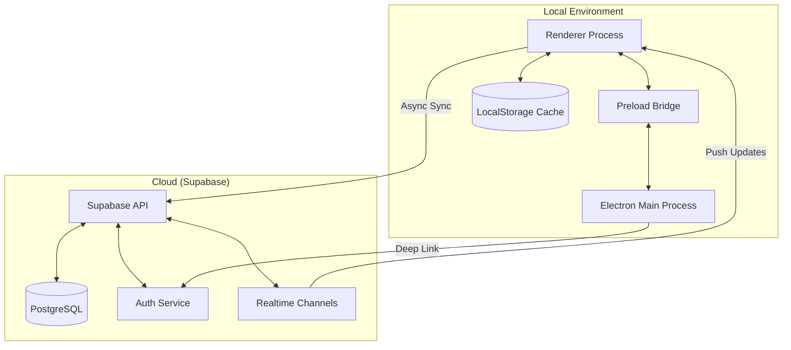
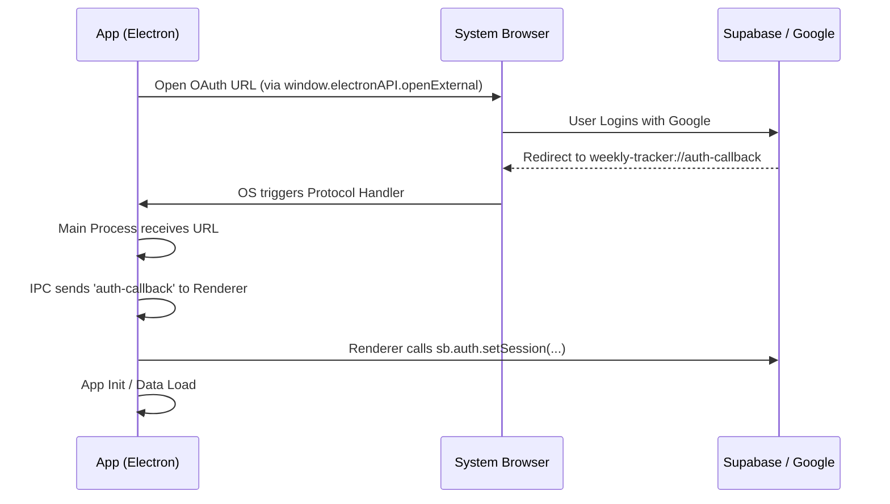

# Personal Tracker: Product Specification

This document provides a detailed technical overview of the Personal Tracker application, intended for debugging, architectural reference, and future feature development.

## 1. System Overview

Personal Tracker is a productivity-focused desktop application built with **Electron** and **Vanilla JavaScript**. It implements a weekly planning cycle, integrating task management (Backlog/Agenda), time tracking (Daily Log/Stopwatch), and habit tracking into a unified interface.

### Tech Stack
-   **Frontend**: Vanilla HTML5, CSS3, JavaScript (ES Modules).
-   **Desktop Wrapper**: Electron (v31.1.1) with `contextBridge` for security.
-   **Backend/Storage**: Supabase (PostgreSQL, Auth, Realtime).
-   **Styling**: Custom modern CSS (vibrant colors, dark mode support).
-   **Icons**: Lucide Icons.

---

## 2. Architecture & Data Flow

The application follows a **Two-Layer Storage** pattern to ensure a lag-free UI while maintaining cloud persistence.



### 2.1 The Two-Layer Storage Strategy
-   **Layer 1 (LocalStorage)**: Acts as a synchronous cache. All UI reads/writes are instant.
-   **Layer 2 (Supabase)**: Acts as the ground truth. After every `save()` to LocalStorage, an asynchronous background sync is triggered to Supabase.

#### Sync Logic Snippet (`js/storage.js`):
```javascript
export function save(d) {
  // 1. Update the local cache (Synchronous)
  d.__updated_at = new Date().toISOString();
  localStorage.setItem(wkKey(), JSON.stringify(d));
  
  // 2. Queue the remote sync (Asynchronous)
  const absWk = getAbsWk(wk);
  if (_syncQueue['week_' + absWk]) clearTimeout(_syncQueue['week_' + absWk]);
  _syncQueue['week_' + absWk] = setTimeout(() => {
    _perfSyncWeek(absWk, d); 
  }, 1500); // 1.5s debounce
}
```

---

## 3. Authentication Flow

Authentication uses **Google OAuth** via Supabase. In the Electron environment, this requires a specific "Deep Link" handshake.



---

## 4. Module Responsibilities

### 4.1 Backlog & Agenda
Manages the "Global tasks" (Backlog) and their transition into the "Weekly Plan" (Agenda).
-   **Enforcement**: Each category in the Agenda is limited to 5 active tasks to prevent overwhelm.
-   **Syncing**: Changes to the backlog are stored in the `backlog` table in Supabase.

### 4.2 Weekly Log (DailyLog)
The core of the application where actual time is tracked.
-   **Stopwatch**: A background-aware timer that stores the current active session in the `profiles` table to survive window reloads or multi-device usage.
-   **Blocks**: Specific activities categorized by "Area" (e.g., Reading, Coding).

### 4.3 Habit Tracker
-   **Built-in Habits**: Hardcoded defaults (`run`, `rest`).
-   **Custom Habits**: Users can add their own habits with weekly targets.
-   **Persistence**: Habit completions are stored inside the `days` array within the `weekly_data` JSON.

---

## 5. Data Model (Supabase)

| Table | Major Columns | Purpose |
| :--- | :--- | :--- |
| `profiles` | `id`, `username`, `active_timer` | User metadata and current timer state. |
| `weekly_data` | `user_id`, `week_offset`, `todos`, `days`, `stack` | Core application state per user/week. |
| `categories` | `user_id`, `name`, `color`, `position` | User-defined organization areas. |
| `habits` | `user_id`, `habit_id`, `name`, `target` | Custom global habits. |
| `backlog` | `user_id`, `items` | Unscheduled tasks pool. |

---

## 6. Debugging Reference

### 6.1 Custom Event Bus
The application uses a `CustomEvent` system on the `document` object to coordinate between decoupled JS modules.

| Event Name | Fired By | Effect in `app.js` |
| :--- | :--- | :--- |
| `wt:auth-ready` | `auth.js` | Boots the application and starts sync. |
| `wt:day-changed` | `dailylog.js` | Triggers a full re-render of Overview/Review/Stack. |
| `wt:cats-changed` | `categories.js` | Re-syncs categorisation and updates charts. |
| `wt:timer-stopped` | `dailylog.js` | Refreshes UI to show the newly logged time block. |
| `wt:remote-change`| `storage.js` | (Realtime) Re-renders the UI when cloud data changes. |

### 6.2 Common Issues
-   **Auth "Black Screen"**: Often caused by `ELECTRON_RUN_AS_NODE` environment variable being set, forcing Electron into a pure Node process instead of a GUI process.
-   **Data Overwrite**: The logic in `loadFromSupabase()` includes a `__updated_at` check. If local data is newer than cloud data (based on ISO timestamp), the cloud data is ignored.
-   **Category Orphans**: If a user renames a category, old logs might point to a non-existent category. The `repairCategories()` function runs on init to "auto-discover" and restore hidden or missing categories from historical logs.
